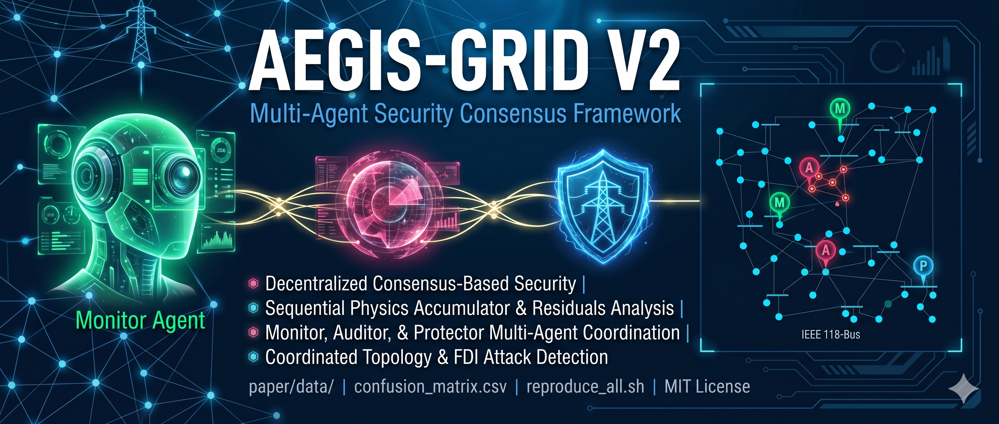

<p align="center">
  
</p>

# XMON-Grid

## Sequential Innovation Accumulation and Cross-Layer Quorum Consensus for Topology-Attack Detection in SCADA-Monitored Transmission Systems

Official research implementation and reproducible evaluation framework accompanying the manuscript:

> **Sequential Innovation Accumulation and Cross-Layer Quorum Consensus for Topology-Attack Detection in SCADA-Monitored Transmission Systems**

---

## Overview

XMON-Grid implements a reproducible multi-layer cyber-physical anomaly detection framework for coordinated topology manipulation and SCADA timing integrity monitoring in transmission systems. 

The framework integrates three complementary sub-detector streams:
- **Physical State Estimation Residuals:** Normalized Innovation Squared ($\text{NIS}$) derived from dynamic Extended Kalman Filtering (EKF).
- **Statistical Drift Monitoring:** Adaptive Page--Hinkley Cumulative Sum (CUSUM) tracking of low-amplitude residual shifts.
- **Communication-Layer Timing Monitoring:** Packet arrival timing jitter statistics ($J$) detecting telemetry network manipulation.

To capture weak, persistent anomalies across extended temporal horizons, XMON-Grid incorporates a sequential innovation accumulator $\Theta(k) = 0.9\Theta(k-1) + \text{NIS}(k)$ with an adaptively calibrated threshold ($\gamma_{\text{seq}} = 241.0850$). Sub-detector outputs are integrated using a multi-agent voting quorum framework establishing both a primary conservative operating point ($K=2$ Strict Majority) and a secondary high-sensitivity operating point ($K=1$ OR Mode).

---

## Benchmark Evaluation & Authoritative Baseline

The framework is evaluated across a deterministic 960-instance benchmark spanning four IEEE transmission network topologies:
- **IEEE 9-bus System**
- **IEEE 14-bus System**
- **IEEE 30-bus System**
- **IEEE 118-bus System**

Under four operational conditions (`baseline`, `branch1_out`, `branch2_out`, `branch3_out`) over 60 trial repetitions per grid/scenario tuple ($4 \times 4 \times 60 = 960$ total observations: $240$ benign normal, $720$ attack instances).

### Authoritative Performance Summary (`results/tsg_run_001/`):

| Decision Quorum / Model | TN | FP | FN | TP | Accuracy | Precision | Recall | F1-Score | FPR |
| :--- | :---: | :---: | :---: | :---: | :---: | :---: | :---: | :---: | :---: |
| **Consensus ($K=2$, Primary Conservative)** | **239** | **1** | **174** | **546** | **0.8177** | **99.82%** | **75.83%** | **0.8619** | **0.42%** |
| **Consensus ($K=1$, Secondary Sensitivity)** | **219** | **21** | **48** | **672** | **0.9281** | **96.97%** | **93.33%** | **0.9512** | **8.75%** |
| **CUSUM Standalone** | 237 | 3 | 170 | 550 | 0.8198 | 99.46% | 76.39% | 0.8641 | 1.25% |
| **JITTER Standalone** | 240 | 0 | 450 | 270 | 0.5313 | 100.00% | 37.50% | 0.5455 | 0.00% |
| **KALMAN Standalone** | 221 | 19 | 57 | 663 | 0.9208 | 97.21% | 92.08% | 0.9458 | 7.92% |

- **Continuous Threat Score Separability:** $\text{ROC AUC} = 0.9982$.
- **Sequential Accumulator Calibration:** Baseline mean $\mu_{\Theta} = 211.8084$, std $\sigma_{\Theta} = 58.5532$, calibrated threshold $\gamma_{\text{seq}} = 241.0850$.

---

## Quick Start & Reproduction

### Installation
```bash
git clone https://github.com/BurhanAbdullah/XMON-Grid.git
cd XMON-Grid
pip install -r requirements.txt
```

### Reproducing the Authoritative Experiment
To execute the complete end-to-end isolated reproduction pipeline:

```bash
python3 scripts/run_isolated_reproduction.py
```

Or execute via the shell driver:
```bash
bash reproduce_all.sh
```

By default, the isolated driver outputs all generated datasets, metrics, tables, and figures to an isolated execution directory (e.g., `results/tsg_run_002/`), preserving the immutable frozen baseline package in `results/tsg_run_001/`.

---

## Repository Structure

```text
XMON-Grid/
├── README.md                          # Repository documentation & guide
├── requirements.txt                   # Python dependencies
├── reproduce_all.sh                   # Master reproduction shell script
├── banner.png                         # Project header graphic
├── scripts/                           # Reproducible experiment & figure scripts
│   ├── run_isolated_reproduction.py   # Isolated execution driver
│   ├── generate_realistic_dataset.py  # Benchmark dataset generator (seed=42)
│   ├── export_paper_data.py           # Quorum metrics evaluator
│   ├── add_sequential_physics.py      # Sequential accumulator trace calculator
│   ├── fix_sequential_threshold.py    # Adaptive threshold calibrator
│   ├── generate_sensitivity_data.py   # Precision-Recall sensitivity generator
│   ├── generate_comparison_table.py   # Quorum comparison table generator
│   └── generate_ieee_figures.py       # Publication figure renderer (Figs 1-4)
├── experiments/                       # Experiment modules and support scripts
├── visualization/                     # Localized case-level visualization tools
├── docs/                              # Reproduction and technical documentation
└── results/
    └── tsg_run_001/                   # AUTHORITATIVE FROZEN RESULT PACKAGE
        ├── SHA256SUMS.txt             # Cryptographic hash manifest
        ├── run_metadata.txt           # Execution & Git commit provenance
        ├── raw/                       # 960-instance raw experiment dataset
        ├── metrics/                   # Labeled prediction traces & sequential states
        ├── tables/                    # Authoritative CSV tables
        └── figures/                   # Authoritative 600-DPI publication figures
```


---

## License

This project is licensed under the MIT License. See [LICENSE](LICENSE) for details.
